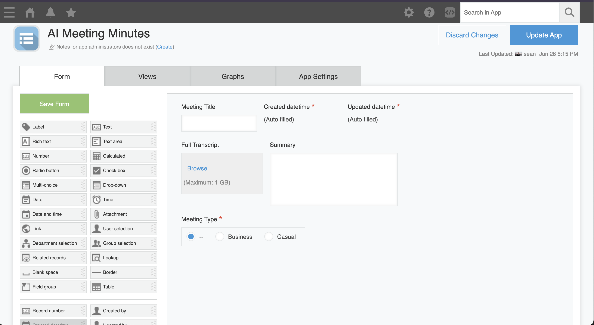
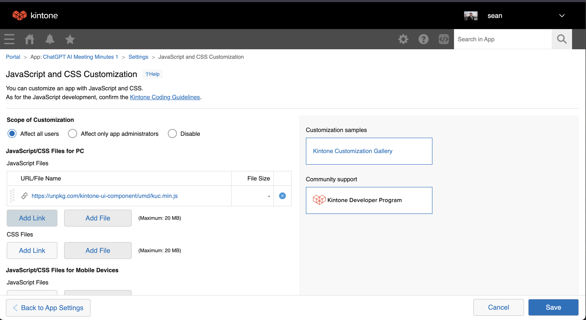
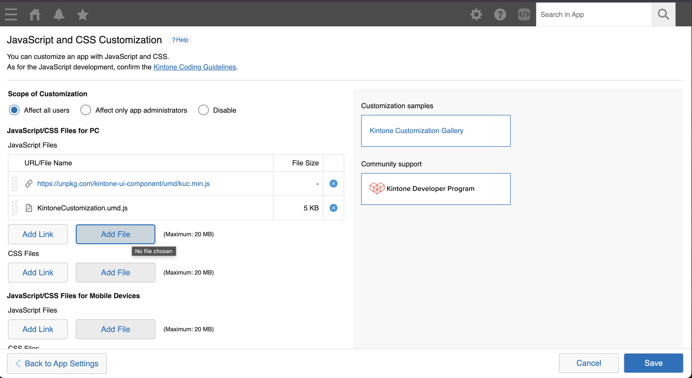
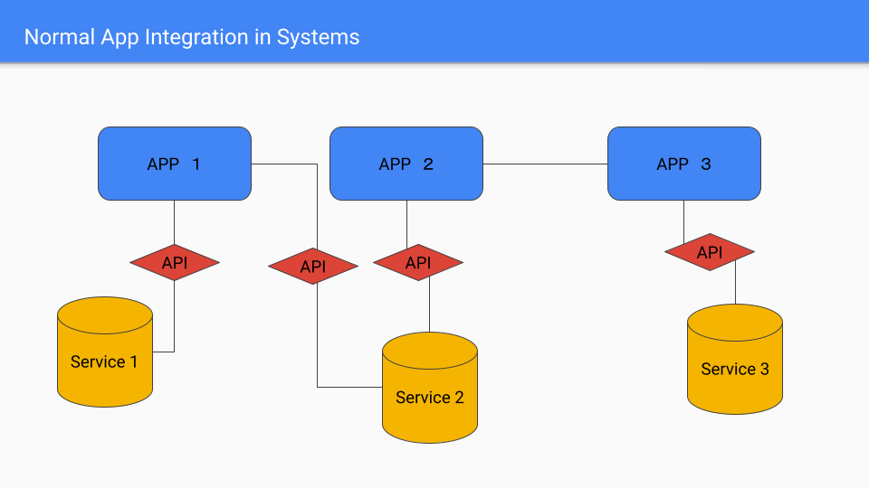
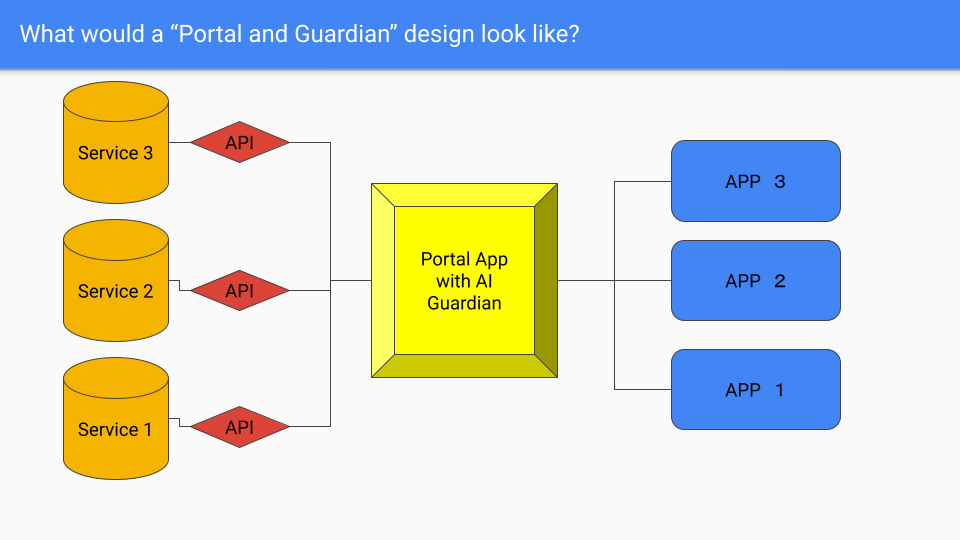

# Kintone AI Meeting Summary

A demo showing a basic integration with OpenAI, and then a more interesting AI based design pattern.

This project consists of two parts:

## Part One
A simple App, which reads the text from an attached text file, and then asks AI to summarize it.
The summarized text is added to the record via a PUT request.

## Part Two
A more advanced design pattern, where an App holding only attachment files uses AI to correctly categorize and sort the text summary into another separate App. In this example, a business meeting summary will be saved to the Business Meeting Summary App, and a casual meeting will be saved into the Casual Meeting App via POST requests.

## Install Steps

1. Clone the repo
2. `cd kintone-ai-meeting-minutes`
3. `npm install`
4. `cp .env.example .env`


## Setting up Part One

### Setting up the Basic Kintone App

|  | Field Type | Name | Field Code |
|---|---|---|---|
| 1 | Text | Title | title |
| 2 | Text area | Summary | summary |
| 3 | Attachment | Full Transcript | transcript |
| 4 | Radio button | Meeting Type | type |
| 5 | Created datetime | -- | -- |
| 6 | Updated datetime | -- | -- |
|  |  |  |  |



### Populate the Database with Data

We have supplied two automatically generated meeting minutes (via Zoom) in this repository:

- [business.txt](./business.txt)
- [casual.txt](./casual.txt)

Use these as examples, or generate your own meeting content to test the AI interpretation.
Attach one to the attachment field of a record, and input a title. Leave the Summary and Meeting Type fields blank, as the AI will fill these in for us.

### Get your API Token


 
Make sure to give the `View Records` permission to the token, and update the App!

### Add your API Tokens and App ID to the .env file

Open the [.env](./.env) file.
In the file, fill out the `VITE_KINTONE_SUBDOMAIN` with your Kintone Subdomain, and `VITE_KINTONE_PART_ONE_APPID` with the APP ID. These can be found easily in the URL of your App.


Also, add the API Token generated above to the `VITE_KINTONE_PART_ONE_TOKEN`.
And finally add your personal Open AI API Token to the `VITE_OPEN_AI_TOKEN`.

``` shell
VITE_KINTONE_SUBDOMAIN="example"
VITE_KINTONE_PART_ONE_TOKEN="abcd2ef3g3hij2kl1"
VITE_KINTONE_PART_ONE_APPID="1"
VITE_OPEN_AI_TOKEN="1234567890"
```

### Make the App look better with Kintone UI Components

This is an easy way to make your customizations look better with our CSS library.
Add the following CDN link to the **JavaScript Files** section in the App settings:
`https://unpkg.com/kintone-ui-component/umd/kuc.min.js`



Check out the [Quick Start Guide](https://ui-component.kintone.dev/docs/getting-started/quick-start/) for more information on how we used Kintone UI Components in this example.

### Build The JavaScript Files, and upload them to Kintone

In the root folder of this project in a terminal, run `npm run build`.
This should create a new folder called `dist` which contains two minified versions of our code:

- KintoneCustomization.mjs
- KintoneCustomization.umd.js

Add the `KintoneCustomization.umd.js` file to your App's JavaScript and CSS Customization settings:



Make sure to **save** and **update** the App after selecting a file.

Navigate to a record, and if a blue `Generate Meeting Minutes` button is displayed, the customization is ready to use.

## Problems with this design pattern

Our App is working, but building small, self contained Apps like this has some problems with scaling.



Image if we were part of a large organization, with hundreds, or thousands of Kintone Apps! Each App having its own API Tokens, connecting to various services... things could get out of hand quickly.

Additionally, this is a very basic and kind of boring use of AI.

What if we could have one Super App, which accepts any input given to it, and sorts in the correct App for users to view?

